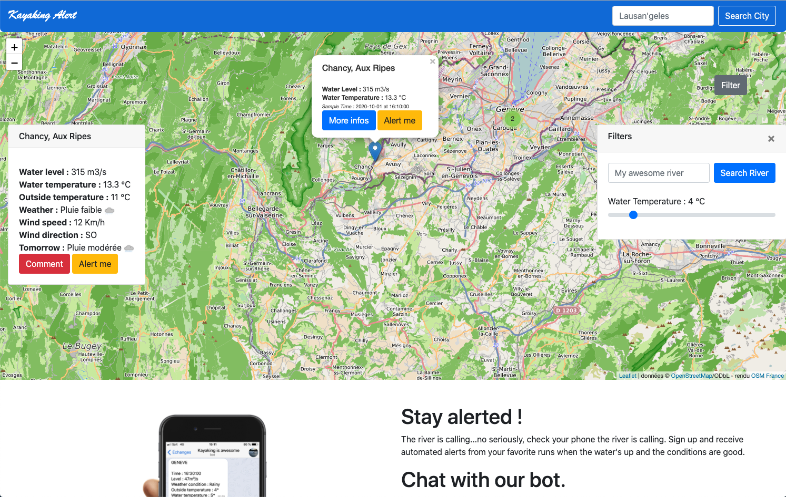

# Kayaking Alert

Kayaking Alert is a website allowing users to check the water level, temperature and weather forecast of their favorite rivers in Switzerland.

One can also look for a specific river or a specific location through the web interface. It is also possible to filter the rivers based on the water temperature for the ones who are sensitive to cold.



The version 2.7 of Python has been used for this project.

# How to run the project ?

### Manually

1. Clone the repository

2. If you're using virtualenv, install the requirements to get all the packages necessary to run the program. 

```
pip install -r path/to/requirements.txt
```

3. Run the program

```
export FLASK_APP=__init__
flask run --host=0.0.0.0
```

4. Navigate to http://localhost:5000/ with a browser

### Docker

1. Clone the repository

2. Create a Docker image locally

```
docker build . -t river:v1
```

3. Run the newly created local image

```
docker run -it -p 5000:5000 river:v1
```

4. Navigate to http://localhost:5000/ with a browser